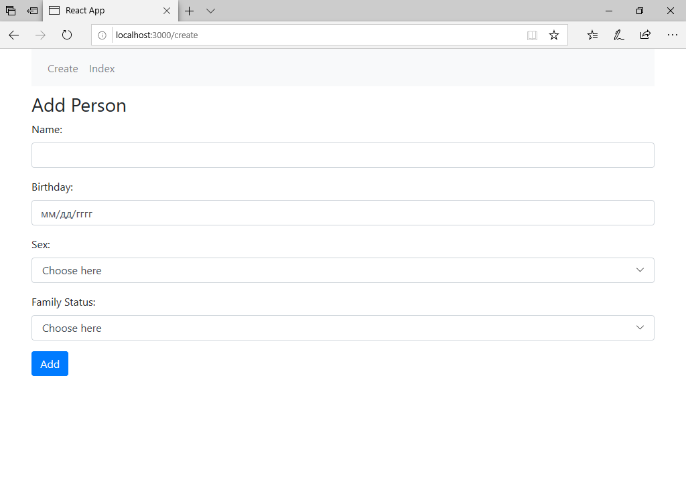

# React-NET.Core
## RESTful
Это *ASP.NET* приложение, которое заточено под работу в стиле *REST*. 
Приложение использует локальную базу данных *mssql*. Для его подключения откройте проект, перейдите в **Package Manager Console** и выполните следующие команды:    

1. Add-Migration Initial.
2. Update-Database.    

После этого запустите проект(Ctrl+F5). Для дальнейшей работы нам нужен будет адрес **localhost**. По нему наш клиент будет обращаться  к серверу.    

## reactcrud
*SPA* приложение, написанное на *React*. 
В компонентах, где встречается **localhost**, замените адреса на те, что присваиваются после запуска *RESTful*.
Откройте в командой строке расположение проекта *reactcrud* и выполните **npm start**.    

